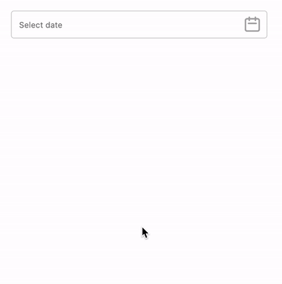

# LiveviewDatepicker

Example datepicker built with Phoenix LiveView.

To start your Phoenix server:

  * Setup the project with `mix setup`
  * Start Phoenix endpoint with `mix phx.server`

Now you can visit [`localhost:4000/datepicker`](http://localhost:4000/datepicker) from your browser to view the datepicker.

